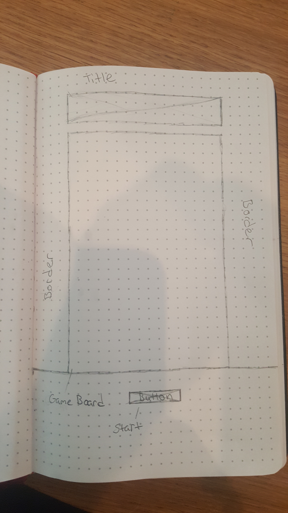
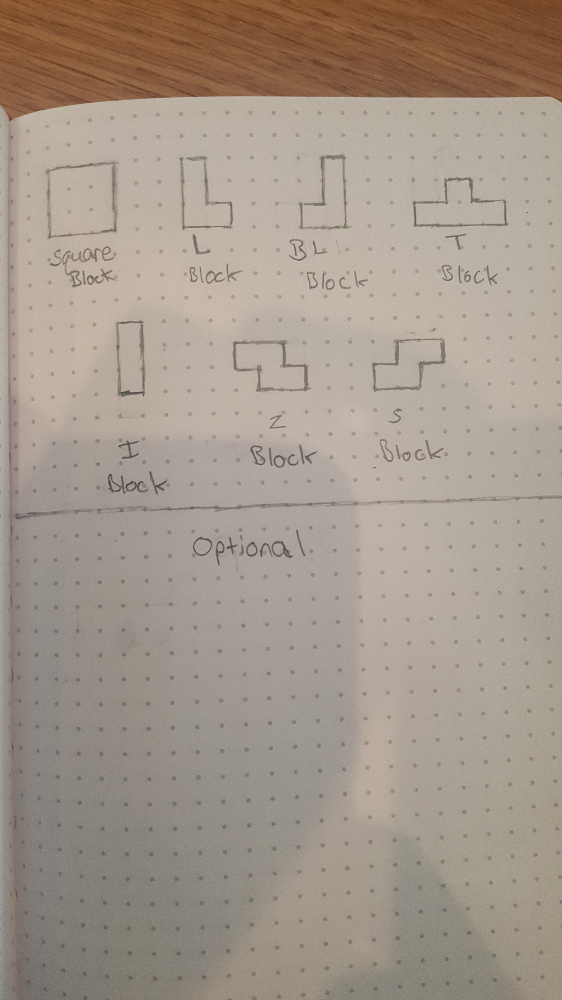

# Project-1

# Tetris aka StackBlox Jr.

## I decided to do my project 1 based on Tetris. I chose this project to help improve my javascript ability and learn more ways to approach problems. It has been the most challenging thing I have done.

## Project link
https://amazing-volhard-444df0.netlify.com/

## Wireframe

# Trello
## https://trello.com/b/aM0l3ZBV/tetris-project-1

# Technologies
## Jquery but never added any in project.
## Javascript
## HTML Canvas
## CSS

